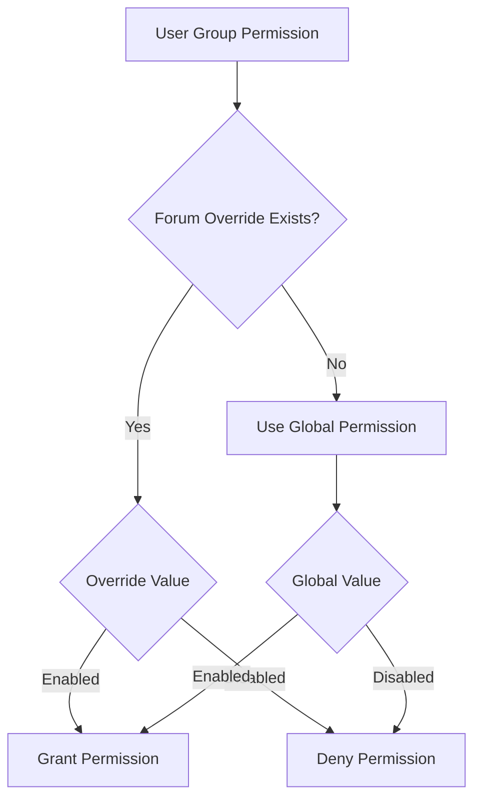

ForkBB uses a sophisticated permission system that combines global group permissions with per-forum overrides.

## Permission Architecture

The permission system operates on two levels:

<Steps>
  <Step title="Global Group Permissions">
    Default permissions defined for each user group
  </Step>
  <Step title="Forum-Specific Permissions">
    Overrides that apply to specific forums
  </Step>
</Steps>

## Group Permissions

User groups define the baseline permissions for all members.

### Permission Categories

<Tabs>
  <Tab title="Basic Access">
    **Read and View Permissions**
    
    ```php Groups.php:567
    'g_read_board' => [
        'type'    => 'radio',
        'value'   => $group->g_read_board,
        'values'  => $yn,
        'caption' => 'Read board label',
        'help'    => 'Read board help',
    ],
    'g_view_users' => [
        'type'    => 'radio',
        'value'   => $group->g_view_users,
        'values'  => $yn,
        'caption' => 'View user info label',
        'help'    => 'View user info help',
    ],
    ```
    
    - **Read board**: Access to view the forum
    - **View users**: See user profiles and information
  </Tab>
  
  <Tab title="Posting">
    **Content Creation Permissions**
    
    ```php Groups.php:588
    'g_post_replies' => [
        'type'    => 'radio',
        'value'   => $group->g_post_replies,
        'values'  => $yn,
        'caption' => 'Post replies label',
        'help'    => 'Post replies help',
    ],
    'g_post_topics' => [
        'type'    => 'radio',
        'value'   => $group->g_post_topics,
        'values'  => $yn,
        'caption' => 'Post topics label',
        'help'    => 'Post topics help',
    ],
    'g_post_links' => [
        'type'    => 'radio',
        'value'   => $group->g_post_links,
        'values'  => $yn,
        'caption' => 'Post links label',
        'help'    => 'Post links help',
    ],
    ```
    
    - **Post replies**: Reply to existing topics
    - **Post topics**: Create new topics
    - **Post links**: Include links in posts
  </Tab>
  
  <Tab title="Editing">
    **Content Modification Permissions**
    
    ```php Groups.php:604
    'g_edit_posts' => [
        'type'    => 'radio',
        'value'   => $group->g_edit_posts,
        'values'  => $yn,
        'caption' => 'Edit posts label',
        'help'    => 'Edit posts help',
    ],
    'g_delete_posts' => [
        'type'    => 'radio',
        'value'   => $group->g_delete_posts,
        'values'  => $yn,
        'caption' => 'Delete posts label',
        'help'    => 'Delete posts help',
    ],
    'g_delete_topics' => [
        'type'    => 'radio',
        'value'   => $group->g_delete_topics,
        'values'  => $yn,
        'caption' => 'Delete topics label',
        'help'    => 'Delete topics help',
    ],
    ```
    
    - **Edit posts**: Modify own posts
    - **Delete posts**: Remove own posts
    - **Delete topics**: Remove own topics
  </Tab>
  
  <Tab title="Search">
    **Search Permissions**
    
    ```php Groups.php:662
    'g_search' => [
        'type'    => 'radio',
        'value'   => $group->g_search,
        'values'  => $yn,
        'caption' => 'User search label',
        'help'    => 'User search help',
    ],
    'g_search_users' => [
        'type'    => 'radio',
        'value'   => $group->g_search_users,
        'values'  => $yn,
        'caption' => 'User list search label',
        'help'    => 'User list search help',
    ],
    ```
    
    - **Search**: Use search functionality
    - **Search users**: Search user lists
  </Tab>
</Tabs>

### Moderator Permissions

<Note>
Moderator permissions require the group's `g_moderator` flag to be enabled.
</Note>

```php Groups.php:511
'g_moderator' => [
    'type'    => 'radio',
    'value'   => $group->g_moderator,
    'values'  => $yn,
    'caption' => 'Mod privileges label',
    'help'    => 'Mod privileges help',
],
```

#### Available Moderator Powers

<CardGroup cols={2}>
  <Card title="Edit Profiles" icon="user-pen">
    ```php Groups.php:518
    'g_mod_edit_users' => [
        'type'    => 'radio',
        'value'   => $group->g_mod_edit_users,
        'values'  => $yn,
        'caption' => 'Edit profile label',
        'help'    => 'Edit profile help',
    ],
    ```
  </Card>
  
  <Card title="Rename Users" icon="signature">
    ```php Groups.php:525
    'g_mod_rename_users' => [
        'type'    => 'radio',
        'value'   => $group->g_mod_rename_users,
        'values'  => $yn,
        'caption' => 'Rename users label',
        'help'    => 'Rename users help',
    ],
    ```
  </Card>
  
  <Card title="Change Passwords" icon="key">
    ```php Groups.php:532
    'g_mod_change_passwords' => [
        'type'    => 'radio',
        'value'   => $group->g_mod_change_passwords,
        'values'  => $yn,
        'caption' => 'Change passwords label',
        'help'    => 'Change passwords help',
    ],
    ```
  </Card>
  
  <Card title="Promote Users" icon="arrow-up">
    ```php Groups.php:539
    'g_mod_promote_users' => [
        'type'    => 'radio',
        'value'   => $group->g_mod_promote_users,
        'values'  => $yn,
        'caption' => 'Mod promote users label',
        'help'    => 'Mod promote users help',
    ],
    ```
  </Card>
  
  <Card title="Ban Users" icon="ban">
    ```php Groups.php:546
    'g_mod_ban_users' => [
        'type'    => 'radio',
        'value'   => $group->g_mod_ban_users,
        'values'  => $yn,
        'caption' => 'Ban users label',
        'help'    => 'Ban users help',
    ],
    ```
  </Card>
</CardGroup>

<Warning>
If `g_moderator` is set to 0, all moderator permissions are automatically disabled.
</Warning>

```php Groups.php:371
if (
    isset($data['g_moderator'])
    && 0 === $data['g_moderator']
) {
    $data['g_mod_edit_users']       = 0;
    $data['g_mod_rename_users']     = 0;
    $data['g_mod_change_passwords'] = 0;
    $data['g_mod_promote_users']    = 0;
    $data['g_mod_ban_users']        = 0;
}
```

### Pre-moderation

```php Groups.php:574
'g_premoderation' => [
    'type'    => 'radio',
    'value'   => $group->g_premoderation,
    'values'  => $yn,
    'caption' => 'Use pre-moderation label',
    'help'    => 'Use pre-moderation help',
],
```

<Info>
Pre-moderation is automatically disabled for moderators:

```php Groups.php:382
if (
    isset($data['g_moderator'])
    && 1 === $data['g_moderator']
) {
    $data['g_premoderation'] = 0;
}
```
</Info>

## Forum Permissions

Forum-specific permissions override global group settings.

### Permission Model

```php Perm.php:26
public function get(Forum $forum): array
{
    $vars = [
        ':fid' => $forum->id > 0 ? $forum->id : 0,
        ':adm' => FORK_GROUP_ADMIN,
    ];
    $query = 'SELECT g.g_id, fp.read_forum, fp.post_replies, fp.post_topics
        FROM ::groups AS g
        LEFT JOIN ::forum_perms AS fp ON (g.g_id=fp.group_id AND fp.forum_id=?i:fid)
        WHERE g.g_id!=?i:adm
        ORDER BY g.g_id';
    
    $perms  = $this->c->DB->query($query, $vars)->fetchAll(PDO::FETCH_UNIQUE);
    $result = [];
    
    foreach ($perms as $gid => $perm) {
        $group  = $this->c->groups->get($gid);
        $group->g_read_forum = $group->g_read_board;
        
        foreach ($perm as $field => $value) {
            $group->{'fp_' . $field}  = $value;
            $group->{'set_' . $field} = (1 === $group->{'g_' . $field} && 0 !== $value) || 1 === $value;
            $group->{'def_' . $field} = 1 === $group->{'g_' . $field};
            $group->{'dis_' . $field} = 0 === $group->g_read_board || ('read_forum' !== $field && $forum->redirect_url);
        }
        
        $result[$gid] = $group;
    }
    
    return $result;
}
```

### Forum Permission Types

<Steps>
  <Step title="Read Forum" icon="eye">
    Allow group members to view forum contents
  </Step>
  <Step title="Post Replies" icon="reply">
    Allow group members to reply to topics
  </Step>
  <Step title="Post Topics" icon="plus">
    Allow group members to create new topics
  </Step>
</Steps>

### Permission States

Each permission can have multiple states:

<AccordionGroup>
  <Accordion title="Default (def_*)">
    Inherits from the global group permission
    
    ```php Perm.php:50
    $group->{'def_' . $field} = 1 === $group->{'g_' . $field};
    ```
  </Accordion>
  
  <Accordion title="Set (set_*)">
    The effective permission value (combining global and override)
    
    ```php Perm.php:49
    $group->{'set_' . $field} = (1 === $group->{'g_' . $field} && 0 !== $value) || 1 === $value;
    ```
  </Accordion>
  
  <Accordion title="Disabled (dis_*)">
    Permission is disabled (e.g., group can't read board or forum is redirect)
    
    ```php Perm.php:51
    $group->{'dis_' . $field} = 0 === $group->g_read_board 
        || ('read_forum' !== $field && $forum->redirect_url);
    ```
  </Accordion>
  
  <Accordion title="Forum Permission (fp_*)">
    The actual override value stored in the database
    
    ```php Perm.php:48
    $group->{'fp_' . $field}  = $value;
    ```
  </Accordion>
</AccordionGroup>

### Updating Forum Permissions

```php Perm.php:65
public function update(Forum $forum, array $perms): void
{
    if ($forum->id < 1) {
        throw new RuntimeException('The forum does not have ID');
    }
    
    foreach ($this->get($forum) as $id => $group) {
        if (0 === $group->g_read_board) {
            continue;
        }
        
        $row     = [];
        $modDef  = false;
        $modPerm = false;
        
        foreach ($this->fields as $field) {
            if ($group->{'dis_' . $field}) {
                $row[$field] = $group->{'set_' . $field} ? 1 : 0;
                $modDef      = $row[$field] !== $group->{'g_' . $field} ? true : $modDef;
            } else {
                $row[$field] = empty($perms[$id][$field]) ? 0 : 1;
                $modDef      = $row[$field] !== $group->{'g_' . $field} ? true : $modDef;
                $modPerm     = $row[$field] !== (int) $group->{'set_' . $field} ? true : $modPerm;
            }
        }
        
        if ($modDef || $modPerm) {
            // Delete existing permission
            $vars = [':gid' => $id, ':fid' => $forum->id];
            $query = 'DELETE FROM ::forum_perms
                WHERE group_id=?i:gid AND forum_id=?i:fid';
            $this->c->DB->exec($query, $vars);
        }
        
        if ($modDef) {
            // Insert new permission override
            $vars   = \array_values($row);
            $vars[] = $id;
            $vars[] = $forum->id;
            $list   = \array_keys($row);
            $list[] = 'group_id';
            $list[] = 'forum_id';
            $list2  = \array_fill(0, \count($list), '?i');
            
            $list   = \implode(', ', $list);
            $list2  = \implode(', ', $list2);
            $query  = "INSERT INTO ::forum_perms ({$list}) VALUES ({$list2})";
            
            $this->c->DB->exec($query, $vars);
        }
    }
}
```

### Resetting Permissions

Revert forum permissions to group defaults:

```php Perm.php:129
public function reset(Forum $forum): void
{
    if ($forum->id < 1) {
        throw new RuntimeException('The forum does not have ID');
    }
    
    $vars = [':fid' => $forum->id];
    $query = 'DELETE FROM ::forum_perms WHERE forum_id=?i:fid';
    
    $this->c->DB->exec($query, $vars);
}
```

This removes all forum-specific permission overrides:

```php Forums.php:411
if ($v->reset) {
    $message = 'Perms reverted redirect';
    $this->c->groups->Perm->reset($forum);
}
```

### Copying Permissions

When creating a new group, permissions are copied from the base group:

```php Perm.php:167
public function copy(Group $from, Group $to): void
{
    if ($from->g_id < 1 || $to->g_id < 1) {
        throw new RuntimeException('The group does not have ID');
    }
    
    $this->delete($to);
    
    $vars = [':old' => $from->g_id, ':new' => $to->g_id];
    $query = 'INSERT INTO ::forum_perms (group_id, forum_id, read_forum, post_replies, post_topics)
        SELECT ?i:new, forum_id, read_forum, post_replies, post_topics
        FROM ::forum_perms
        WHERE group_id=?i:old';
    
    $this->c->DB->exec($query, $vars);
}
```

Used when creating groups:

```php Groups.php:409
if (null === $group->g_id) {
    $message = 'Group added redirect';
    $this->c->groups->insert($group);
    $this->c->groups->Perm->copy($baseGroup, $group);
}
```

## Special Groups

### Administrator Group

<Warning>
The administrator group (FORK_GROUP_ADMIN) is excluded from forum permission management:

```php Perm.php:30
':adm' => FORK_GROUP_ADMIN,
```

```sql
WHERE g.g_id!=?i:adm
```

Administrators always have full access to all forums.
</Warning>

### Guest Group

Guests have limited permission options. Some features are automatically disabled:

```php Groups.php:277
if ($group->groupGuest) {
    $v->addRules([
        'a_guest_set.show_smilies' => 'required|integer|in:0,1',
        'a_guest_set.show_sig'     => 'required|integer|in:0,1',
        'a_guest_set.show_avatars' => 'required|integer|in:0,1',
        'a_guest_set.show_img'     => 'required|integer|in:0,1',
        'a_guest_set.show_img_sig' => 'required|integer|in:0,1',
    ]);
}
```

### Moderator Group

Moderators cannot be in groups used as default user group:

```php Groups.php:263
if (
    ! $group->groupGuest
    && ! $group->groupMember
    && $group->g_id !== $this->c->config->i_default_user_group
) {
    $v->addRules([
        'g_moderator'            => 'required|integer|in:0,1',
        'g_mod_edit_users'       => 'required|integer|in:0,1',
        // ... other moderator permissions
    ]);
}
```

## Permission Hierarchy

The permission system follows this hierarchy:



## Flood Control

<Info>
Flood control limits are defined per group to prevent spam:
</Info>

```php Groups.php:737
'g_post_flood' => [
    'type'    => 'number',
    'min'     => '0',
    'max'     => '32767',
    'value'   => $group->g_post_flood,
    'caption' => 'Post flood label',
    'help'    => 'Post flood help',
],
'g_search_flood' => [
    'type'    => 'number',
    'min'     => '0',
    'max'     => '32767',
    'value'   => $group->g_search_flood,
    'caption' => 'Search flood label',
    'help'    => 'Search flood help',
],
```

Additional flood controls for non-guests:

```php Groups.php:763
'g_email_flood' => [
    'type'    => 'number',
    'min'     => '0',
    'max'     => '32767',
    'value'   => $group->g_email_flood,
    'caption' => 'E-mail flood label',
    'help'    => 'E-mail flood help',
],
'g_report_flood' => [
    'type'    => 'number',
    'min'     => '0',
    'max'     => '32767',
    'value'   => $group->g_report_flood,
    'caption' => 'Report flood label',
    'help'    => 'Report flood help',
],
```

## Best Practices

<Tip>
**Permission Management Tips:**

1. **Start Restrictive**: Begin with minimal permissions and add as needed
2. **Test Thoroughly**: Verify permissions work as expected before going live
3. **Document Changes**: Keep notes about custom forum permissions
4. **Regular Audits**: Review permissions periodically
5. **Group Planning**: Design your group structure before assigning permissions
6. **Forum Defaults**: Use forum-specific permissions sparingly - prefer group-level settings
</Tip>

## Permission Conflicts

<Warning>
**Conflict Resolution Rules:**

1. If a group can't read the board, all other permissions are disabled
2. Forum-specific permissions override group permissions
3. Disabled fields (redirect forums) ignore overrides
4. Moderators bypass pre-moderation automatically
5. Administrators always have full access
</Warning>

## Next Steps

<CardGroup cols={2}>
  <Card title="User Groups" icon="user-group" href="/admin/user-management">
    Learn about user group management
  </Card>
  <Card title="Forum Management" icon="comments" href="/admin/forum-management">
    Configure forums and permissions
  </Card>
  <Card title="Group Model" icon="code" href="/models/group">
    Understand the Group model API
  </Card>
  <Card title="Security" icon="shield" href="/security/overview">
    Review security best practices
  </Card>
</CardGroup>