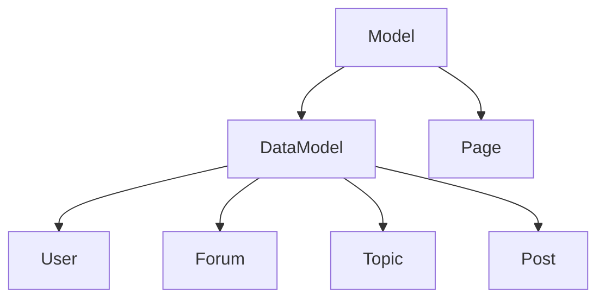

## Overview

ForkBB uses an **Active Record** pattern where models represent both data and behavior. Models provide:

- **Data encapsulation** with property getters/setters
- **Computed properties** (lazy evaluation)
- **Change tracking** (for DataModel)
- **Relationship handling** (parent/child models)
- **Business logic methods**

## Model Hierarchy



<CardGroup cols={2}>
  <Card title="Model" icon="cube">
    Base class with properties and computed values
  </Card>
  <Card title="DataModel" icon="database">
    Extends Model with change tracking
  </Card>
  <Card title="Page" icon="file">
    Base class for page/view models
  </Card>
  <Card title="Domain Models" icon="shapes">
    User, Forum, Topic, Post, etc.
  </Card>
</CardGroup>

## Base Model Class

All models extend the base `Model` class:

```php app/Models/Model.php
class Model
{
    protected string $cKey = 'unknown';      // Container key
    protected array $zAttrs = [];            // Raw attributes
    protected array $zAttrsCalc = [];        // Computed attributes
    protected array $zDepend = [];           // Property dependencies
    protected Manager $manager;              // Manager instance
    
    public function __construct(protected Container $c) {}
    
    // Property access methods
    public function __get(string $name): mixed
    public function __set(string $name, mixed $value): void
    public function __isset(string $name): bool
    public function __unset(string $name): void
    
    // Method loading (for external methods)
    public function __call(string $name, array $args): mixed
}
```

### Property Access

Models use magic methods for property access:

```php
// Setting properties
$user->username = 'JohnDoe';
$user->email = 'john@example.com';

// Getting properties
echo $user->username;  // 'JohnDoe'
echo $user->email;     // 'john@example.com'

// Computed properties (via getter methods)
echo $user->isAdmin;   // Calls getisAdmin() method
echo $user->link;      // Calls getlink() method

// Checking if property exists
if (isset($user->avatar)) {
    echo $user->avatar;
}

// Removing property
unset($user->signature);
```

### Computed Properties

Define getter methods for computed values:

```php app/Models/User/User.php
class User extends DataModel
{
    /**
     * Check if user is admin
     */
    protected function getisAdmin(): bool
    {
        return FORK_GROUP_ADMIN === $this->group_id;
    }
    
    /**
     * Check if user is guest
     */
    protected function getisGuest(): bool
    {
        return FORK_GROUP_GUEST === $this->group_id
            || null === $this->group_id
            || $this->id < 1;
    }
    
    /**
     * Get link to user profile
     */
    protected function getlink(): ?string
    {
        if ($this->isGuest) {
            return null;
        }
        
        return $this->c->Router->link('User', [
            'id' => $this->id,
            'name' => $this->c->Func->friendly($this->username)
        ]);
    }
    
    /**
     * Get number of topics per page for this user
     */
    protected function getdisp_topics(): int
    {
        $attr = $this->getModelAttr('disp_topics');
        
        if ($attr < 10) {
            $attr = $this->c->config->i_disp_topics_default;
        }
        
        return $attr;
    }
}
```

<Note>
Computed properties are cached after first access. The cache is automatically cleared when dependent properties change.
</Note>

## DataModel Class

Extends `Model` with **change tracking** for database persistence:

```php app/Models/DataModel.php
class DataModel extends Model
{
    protected array $zModFlags = [];      // Modified properties
    protected array $zTrackFlags = [];    // Tracking state
    
    // Get list of modified properties
    public function getModified(): array
    
    // Check if property was modified
    public function isModified(string $name): bool
    
    // Reset modification flags
    public function resModified(): void
}
```

### Change Tracking

```php
$user = $c->users->load(123);

// Make changes
$user->email = 'newemail@example.com';
$user->signature = 'My new signature';

// Check what changed
if ($user->isModified('email')) {
    echo 'Email was changed';
}

// Get all modified properties
$modified = $user->getModified();
// Result: ['email', 'signature']

// Save only modified fields to database
$c->users->update($user);

// Reset modification tracking
$user->resModified();
```

## Domain Models

### User Model

Represents forum users:

```php app/Models/User/User.php
class User extends DataModel
{
    protected string $cKey = 'User';
    
    // Properties
    public int $id;
    public int $group_id;
    public string $username;
    public string $email;
    public int $num_posts;
    public int $last_visit;
    // ... more properties
    
    // Computed properties
    public function getisAdmin(): bool;
    public function getisGuest(): bool;
    public function getisAdmMod(): bool;
    public function getonline(): bool;
    public function getlink(): ?string;
    public function getavatar(): ?string;
    
    // Methods
    public function title(): string;
    public function deleteAvatar(): void;
    public function isModerator(Model $model): bool;
}
```

<CodeGroup>

```php Check Permissions
$user = $c->user;  // Current user

if ($user->isGuest) {
    // Redirect to login
} elseif ($user->isAdmin) {
    // Show admin panel
} elseif ($user->isAdmMod) {
    // Show moderator tools
}
```

```php User Information
$user = $c->users->load(123);

echo $user->username;        // Username
echo $user->title();         // User title
echo $user->link;            // Profile URL
echo $user->avatar;          // Avatar URL
echo $user->num_posts;       // Post count
echo $user->online ? 'Online' : 'Offline';
```

</CodeGroup>

### Forum Model

Represents forum categories and forums:

```php app/Models/Forum/Forum.php  
class Forum extends DataModel
{
    protected string $cKey = 'Forum';
    
    // Properties
    public int $id;
    public int $parent_forum_id;
    public string $forum_name;
    public string $forum_desc;
    public int $num_topics;
    public int $num_posts;
    public int $last_post;
    // ... more properties
    
    // Relationships
    public function getparent(): ?Forum;
    public function getsubforums(): array;
    public function getdescendants(): array;
    
    // Computed properties
    public function getlink(): string;
    public function getlinkNew(): string;
    public function getlinkLast(): string;
    public function getcanCreateTopic(): bool;
    
    // Methods
    public function modAdd(User ...$users): void;
    public function modDelete(User ...$users): void;
    public function pageData(): array;
}
```

<CodeGroup>

```php Forum Navigation
$forum = $c->forums->get(123);

echo $forum->forum_name;     // Forum name
echo $forum->link;           // Forum URL
echo $forum->linkNew;        // New posts URL

// Parent forum
if ($parent = $forum->parent) {
    echo $parent->forum_name;
}

// Subforums
foreach ($forum->subforums as $sub) {
    echo $sub->forum_name;
    echo $sub->link;
}
```

```php Forum Permissions
if ($forum->canCreateTopic) {
    echo '<a href="' . $forum->linkCreateTopic . '">New Topic</a>';
}

if ($forum->canMarkRead) {
    echo '<a href="' . $forum->linkMarkRead . '">Mark Read</a>';
}

if ($forum->canSubscription) {
    echo '<a href="' . $forum->linkSubscribe . '">Subscribe</a>';
}
```

</CodeGroup>

## Property Dependencies

Define which computed properties depend on which raw properties:

```php
class User extends DataModel
{
    public function __construct(Container $container)
    {
        parent::__construct($container);
        
        // When these properties change, clear these computed properties
        $this->zDepend = [
            'group_id' => ['isUnverified', 'isGuest', 'isAdmin', 'isAdmMod', 'link'],
            'id'       => ['isGuest', 'link', 'online'],
            'username' => ['username_normal'],
            'email'    => ['email_normal', 'linkEmail'],
        ];
    }
}
```

When a property changes, dependent computed properties are automatically cleared from cache.

## Working with Models

### Creating Models

```php
// Create new user
$user = $c->users->create();
$user->username = 'NewUser';
$user->email = 'user@example.com';
$user->group_id = FORK_GROUP_MEMBER;
$c->users->insert($user);

// Create with attributes
$user = $c->users->create([
    'username' => 'NewUser',
    'email' => 'user@example.com',
    'group_id' => FORK_GROUP_MEMBER,
]);
$c->users->insert($user);
```

### Loading Models

```php
// Load by ID
$user = $c->users->load(123);

// Load current user
$currentUser = $c->user;

// Load forum
$forum = $c->forums->get(5);
```

### Updating Models

```php
$user = $c->users->load(123);

// Modify properties
$user->email = 'newemail@example.com';
$user->signature = 'New signature';

// Save changes
$c->users->update($user);
```

### Deleting Models

```php
$user = $c->users->load(123);
$c->users->delete($user);
```

## Model Managers

Managers handle collections and database operations:

```php
class Users extends Manager
{
    // Load user by ID
    public function load(int $id): ?User;
    
    // Create new user
    public function create(array $attrs = []): User;
    
    // Insert user to database
    public function insert(User $user): int;
    
    // Update user in database
    public function update(User $user): User;
    
    // Delete user from database  
    public function delete(User $user): void;
    
    // Get current user
    public function current(): User;
}
```

## Best Practices

<AccordionGroup>
  <Accordion title="Use Computed Properties">
    Don't store derived data. Compute it on demand.
    
    ```php
    // Good
    protected function getfullName(): string {
        return $this->first_name . ' ' . $this->last_name;
    }
    
    // Bad - storing derived data
    $user->full_name = $user->first_name . ' ' . $user->last_name;
    ```
  </Accordion>
  
  <Accordion title="Define Dependencies">
    Always define property dependencies for cache invalidation.
    
    ```php
    $this->zDepend = [
        'group_id' => ['isAdmin', 'permissions'],
        'email'    => ['email_normal'],
    ];
    ```
  </Accordion>
  
  <Accordion title="Type Hint Returns">
    Use return type hints for computed properties.
    
    ```php
    protected function getisAdmin(): bool { ... }
    protected function getlink(): ?string { ... }
    protected function getsubforums(): array { ... }
    ```
  </Accordion>
  
  <Accordion title="Keep Business Logic in Models">
    Don't put business logic in controllers. It belongs in models.
    
    ```php
    // Good - in User model
    public function canEditPost(Post $post): bool {
        return $this->id === $post->poster_id 
            || $this->isAdmin
            || $this->isModerator($post->parent);
    }
    ```
  </Accordion>
</AccordionGroup>

## Next Steps

<CardGroup cols={2}>
  <Card title="Controllers" icon="gears" href="/controllers">
    Use models in controllers
  </Card>
  <Card title="Views" icon="eye" href="/views">
    Display model data in templates
  </Card>
</CardGroup>
